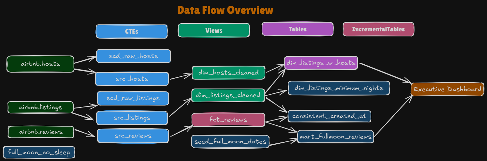

### DBT (Data Build Tool) Bootcamp - Zero to Hero by Zoltan C

##### Create Virutal Env

> uv venv --python 3.11

##### Activate Virtual Env

> .venv\Scripts\activate

##### Install DBT & Create DBT Home Folder

> uv pip install dbt-snowflake==1.10.3
> mkdir %userprofile%\.dbt

##### Create project

> dbt init dbtlearn

##### Data Flow Architecture

#### Notes:

- **Models:** objects (tables/views/ctes) which are created in dbt
  - materialization: table/view/cte(ephemeral)/incremental
  - incremental does not handle history change (the way snapshots(scd type-2) does)
  - incremental is used for sources that do not change (scd type-0) eg: fact tables, fct_reviews
- **Seeds:** small files which we want to use in dbt as source tables
- **Sources:** tables which are not created in dbt, but are there in warehouse, and we want a way to easily refer then in dbt
  - making a table into a source provides features such as source freshness
- **snapshots:** scd type-2 tables, with all logic handled by dbt
  - kind of like an incremental table, with scd type-2 implementation
  - invalidate_hard_deletes = True: whenever a unique_id is deleted from source table, its dbt_valid_till_date is set to snapshot_date, without invalidate_hard_deletes it will not be detected, and the unique_id will continue to show as valid
- **Tests**
  - **singular:** SQL queries stored in /tests which are expected to return an empty result set
    - declared in the tests/ folder
  - **generic (built-in):** unique, not_null, accepted_values, relationships
    - declared in the models/schema.yaml file
  - can also declare custom tests, or import third party tests from dbt
    - mainly macros are used here
