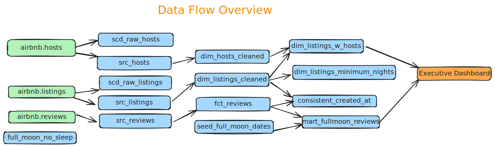

### DBT (Data Build Tool) Bootcamp - Zero to Hero by Zoltan C

##### Create Virutal Env

> uv venv --python 3.11

##### Activate Virtual Env

> .venv\Scripts\activate

##### Install DBT & Create DBT Home Folder

> uv pip install dbt-snowflake==1.10.3
> mkdir %userprofile%\.dbt

##### Create project

> dbt init dbtlearn

##### Data Flow Architecture

